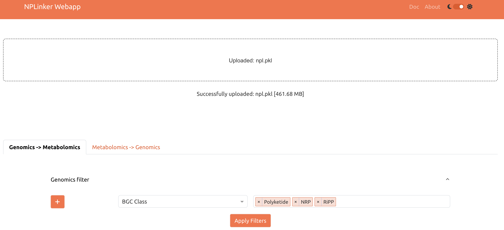
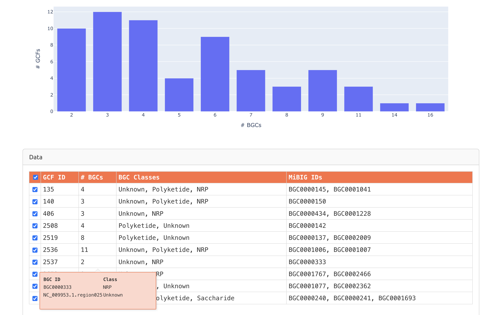
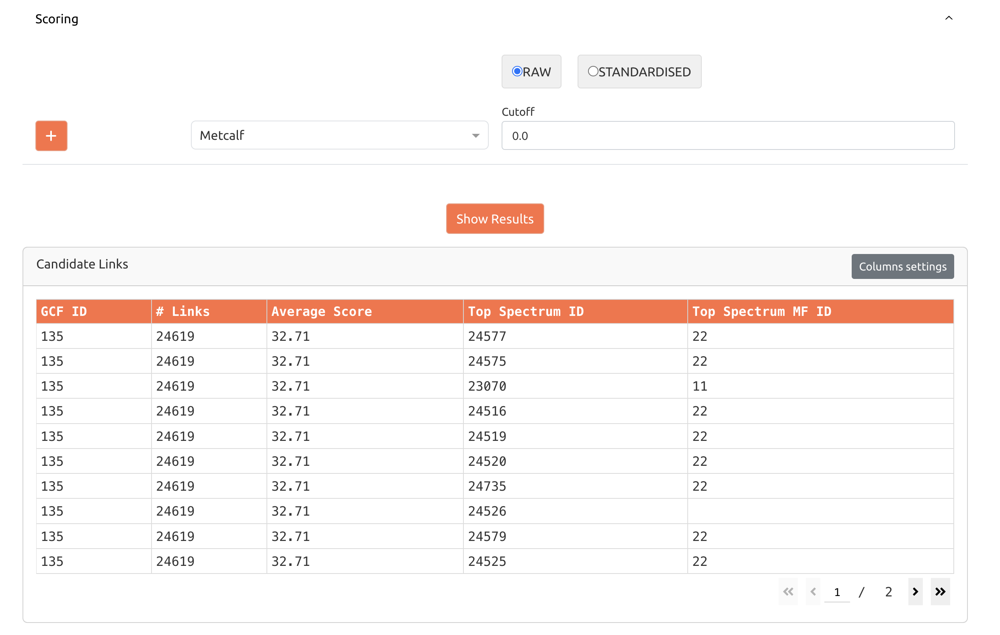

# NPLinker Web Application

This is the [NPLinker](https://nplinker.github.io/nplinker/latest/) web application, developed with [Plotly Dash](https://dash.plotly.com/), which enables you to visualize NPLinker predictions in an interactive way.

<p align="center">
  
</p>

<p align="center">
  
</p>

<p align="center">
  
</p>

NPLinker is a Python framework for data mining microbial natural products by integrating genomics and metabolomics data.

For a deep understanding of NPLinker, please refer to the [original paper](https://journals.plos.org/ploscompbiol/article?id=10.1371/journal.pcbi.1008920).

## Prerequisites

Before installing NPLinker Web Application, ensure you have:

- [Python 3.10](https://www.python.org/downloads/)
- [Git](https://git-scm.com/downloads)

## Installation Options

You can install and run the NPLinker dashboard in two ways: directly on your local machine or using Docker.

### Option 1: Local Installation

Follow these steps to install the application directly on your system:

1. **Clone the repository**
   ```bash
   git clone https://github.com/NPLinker/nplinker-webapp.git
   cd nplinker-webapp
   ```

2. **Set up a virtual environment**
   ```bash
   # Create a virtual environment
   python3.10 -m venv venv

   # Activate the virtual environment
   # For Windows:
   venv\Scripts\activate
   # For macOS/Linux:
   source venv/bin/activate
   ```

3. **Install dependencies**
   ```bash
   pip install -e .
   ```

4. **Run the application**
   ```bash
   python app/main.py
   ```

5. **Access the dashboard**
   
   Open your web browser and navigate to `http://0.0.0.0:8050/`

#### Troubleshooting Local Installation

Common issues and solutions:

- **Port already in use**: If port 8050 is already in use, modify the port in `app/main.py` by changing `app.run_server(debug=True, port=8050)`
- **Package installation errors**: Make sure you're using Python 3.10 and that your pip is up-to-date

If you encounter other problems, please check the [Issues](https://github.com/NPLinker/nplinker-webapp/issues) page or create a new issue.

### Option 2: Docker Installation

Using Docker is the quickest way to get started with NPLinker Web Application. Make sure you have [Docker](https://www.docker.com/) installed on your system before proceeding:

1. **Pull the Docker image**
   ```bash
   docker pull ghcr.io/nplinker/nplinker-webapp:latest
   ```

2. **Run the container**
   ```bash
   docker run -p 8050:8050 ghcr.io/nplinker/nplinker-webapp:latest
   ```

3. **Access the dashboard**
   
   Open your web browser and navigate to `http://0.0.0.0:8050/`

#### Docker Image Information

- **Available Tags**:
  - `latest`: The most recent build
  - Specific version tags based on GitHub releases

- **Performance Note**: The application running in Docker might be slower than running it directly on your machine, depending on your Docker resource allocation settings. If you experience performance issues, consider increasing Docker's CPU and memory limits in your Docker Desktop settings, or use the local installation method.

- **More Details**: For additional information about the Docker image, see its [GitHub Container Registry page](https://github.com/NPLinker/nplinker-webapp/pkgs/container/nplinker-webapp).

## Using the Dashboard

### Input Data

The dashboard accepts data generated by NPLinker and saved as described in the [NPLinker quickstart section](https://nplinker.github.io/nplinker/latest/quickstart/). For testing purposes, a small sample dataset is provided in [`tests/data/mock_obj_data.pkl`](https://github.com/NPLinker/nplinker-webapp/blob/main/tests/data/mock_obj_data.pkl) that can be used to try out the webapp.

Please note that links between genomic and metabolomic data must currently be computed using the NPLinker API separately, as this functionality is not yet implemented in the webapp (see [issue #19](https://github.com/NPLinker/nplinker-webapp/issues/19)). If no links are present in your data, the scoring table will be disabled.

### Filtering Table Data

The "Candidate Links" tables support data filtering to help you focus on relevant results. You can enter filter criteria directly into each column’s filter cell by hovering over the cell.

For numeric columns like "Average Score" or "# Links":
- `34.6` or `= 34.6` (exact match)
- `> 30` (greater than)
- `<= 50` (less than or equal to)

For text columns like "BGC Classes" or "MiBIG IDs":
- `Polyketide` or `contains Polyketide` (contains text)
- `= Polyketide` (exact match)

Multiple filters can be applied simultaneously across different columns to narrow down results.

For a full list of supported filter operators, see the [official Plotly documentation](https://dash.plotly.com/datatable/filtering#filtering-operators).

## Contributing

If you want to contribute to the development of NPLinker, have a look at the [contribution guidelines](CONTRIBUTING.md) and [README for developers](README.dev.md).